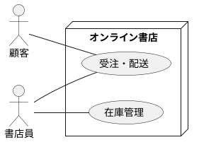
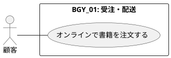
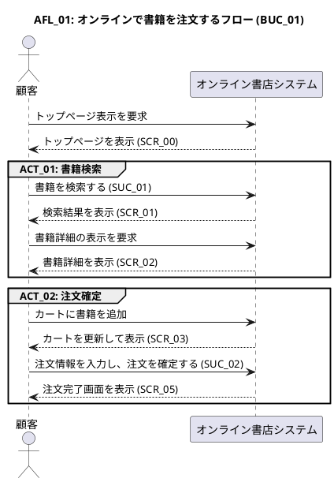
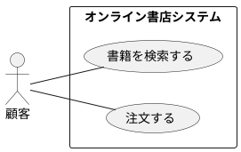
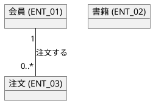
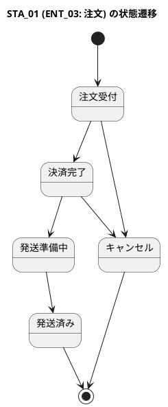
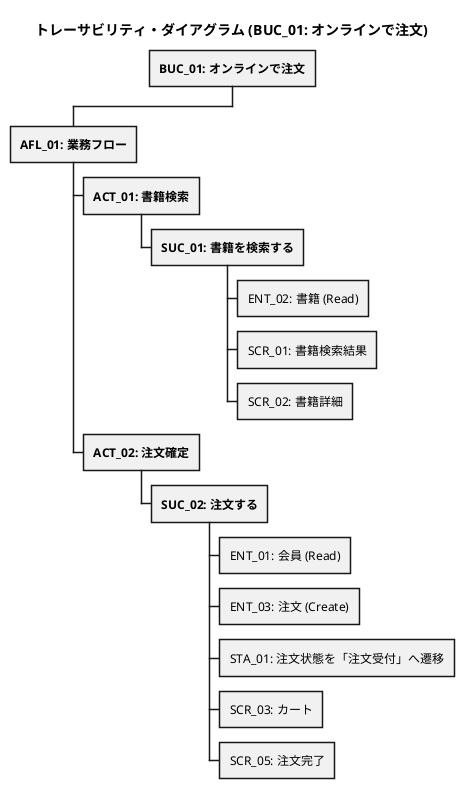

# **RDRA 2.0 要求分析手法の体系的解説（AIコンテキスト用）**

このドキュメントは、Generative AIがRDRA 2.0を理解し、関連タスクを実行するためのコンテキストを提供することを目的とします。RDRAの核心は、**要件の依存関係を構造化し、トレーサビリティを確保すること**にあります。

## **1\. RDRAの基本理念：依存関係の構造**

RDRAは、以下の依存関係に基づき、要件を合理的に決定します。下位の要素は、上位の要素の存在理由（Why）に答えるために存在します。

### **システム価値 ← システム利用環境 ← システム境界 ← システム内部**

- **Why（なぜ必要か）**: 右の要素（内部）から左の要素（価値）へ遡ることで、その要素の存在理由を説明できます。
- **How（どう実現するか）**: 左の要素（価値）から右の要素（内部）へ具体化することで、要求の実現方法を定義します。

この論理的な繋がりこそが、RDRAの品質保証の核となります。

## **2\. RDRAの4階層レイヤーモデルと主要モデル**

RDRAでは、上記の依存関係を4つの階層（レイヤー）に分けて要求を整理します。

### **レイヤー1：システム価値 (System Value)**

- **目的**: システムが「誰のために」「何を」実現するのか、プロジェクトの根本的な方向性を定めます。
- **主要モデル**:
  - **システムコンテキスト図**: システムに関わる**アクター（関係者）と外部システム**を洗い出し、システムの全体的な位置づけを明確にします。

### **レイヤー2：システム外部環境 (System External Environment)**

- **目的**: システムがビジネスの中で「どのように」利用されるかを具体的に定義します。
- **主要モデル**:
  - **ビジネスコンテキスト図**: システムが対象とするビジネス領域（**業務**）を定義します。
  - **ビジネスユースケースモデル**: 特定の価値を提供する一連の業務の流れの単位（**ビジネスユースケース**）を定義します。
  - **業務フロー図**: ビジネスユースケースを構成する具体的な作業（**アクティビティ**）の流れを可視化します。**このフローの中で、システム化されるべき作業がシステムユースケースの候補となります。**

### **レイヤー3：システム境界 (System Boundary)**

- **目的**: システムと外部との接点（インターフェース）を明確にします。
- **主要モデル**:
  - **システムユースケースモデル**: システムが提供する一つの仕事の単位（**ユースケース**）を定義します。
  - **画面モデル**: 人（アクター）がシステムと対話するためのインターフェース（**画面**）と画面遷移を定義します。

### **レイヤー4：システム (System)**

- **目的**: システムが内部で「何を」扱うべきか、根幹をなす情報（データ）とその状態を定義します。
- **主要モデル**:
  - **情報モデル**: システムが管理すべきデータ構造（**情報**）を定義します。
  - **状態モデル**: 情報が取りうるライフサイクル（**状態**）を定義します。

## **3\. ID命名規則とファイル規約**

AIがトレーサビリティを確保し、各モデルをファイルとして管理しやすくするための規約を以下に定義します。

### **3.1. ID命名規則**

各モデルの要素には、トレーサビリティを確保するために一意のIDを付与します。

- **ID接頭辞**: BGY (業務), BUC (ビジネスユースケース), AFL (アクティビティフロー), ACT (アクティビティ), SUC (システムユースケース), ENT (情報), STA (状態), SCR (画面)

### **3.2. ファイル命名規則**

各モデルのダイアグラムは個別のファイルとして保存することを想定し、以下の命名規則に従います。ファイル名は、関連する主要なIDとモデルの種類がわかるように構成します。

- **形式**: {主要ID}\_{モデル名(英語)}.puml
- **補足**:
  - モデルが特定のIDに紐づかない場合（例：全体を俯瞰するモデル）、IDは省略可能です。
- **モデル名一覧**:
  - ビジネスコンテキスト図: business_context
  - ビジネスユースケースモデル: business_usecase
  - 業務フロー図: activity_flow
  - システムユースケースモデル: system_usecase
  - 情報モデル: information_model
  - 状態モデル: state_model
- **例**:
  - BGY_business_context.puml
  - BUC_01_business_usecase.puml
  - AFL_01_activity_flow.puml
  - SUC_system_usecase.puml
  - ENT_information_model.puml
  - STA_01_state_model.puml

### **3.3. モデルサンプル**

#### **【レイヤー1 & 2】 ビジネスコンテキスト図**

#### **【レイヤー2】 ビジネスユースケースモデル**

#### **【レイヤー2】 業務フロー図 (AFL_01 for BUC_01)**

#### **【レイヤー3】 システムユースケースモデル**

#### **【レイヤー4】 情報モデル**

#### **【レイヤー4】 状態モデル**

## **4\. モデル間の関係性（トレーサビリティ）**

### **4.1. 関係性の概念**

RDRAの各モデルは独立して存在するのではなく、**「1. RDRAの基本理念」で示した依存関係の構造に基づき、相互に強く関連しています。このモデル間の繋がりをトレーサビリティ**と呼びます。

トレーサビリティは、ある要素が「なぜ (Why) 存在するのか」を上位のレイヤーに遡って説明し、「どのように (How) 実現されるのか」を下位のレイヤーに具体化するための論理的な道筋です。例えば、特定の「情報（レイヤー4）」は、ある「画面（レイヤー3）」を表示するために必要であり、その「画面」は特定の「業務フロー（レイヤー2）」を遂行するために不可欠です。

この関係性を明確に定義することで、以下の品質が確保されます。

- **整合性**: 全ての要素の存在理由が説明可能になります。
- **網羅性**: 要求の抜け漏れを構造的に防ぎます。
- **変更への追随性**: 仕様変更時の影響範囲を正確に特定できます。

### **4.2. 関係性定義の規約：トレーサビリティ・マトリクス**

モデル間の具体的な関係性は、**トレーサビリティ・マトリクス**形式で定義します。

#### **大規模開発における考慮点**

システム全体の要求を一枚の巨大な表で表現すると、規模が大きくなるにつれて可読性やメンテナンス性が著しく低下します。

そのため、実用的なアプローチとして、**関心事の単位でマトリクスを分割する**ことが推奨されます。最も一般的な分割単位は\*\*「ビジネスユースケース（BUC）」\*\*です。特定のビジネス価値の実現に焦点を当てることで、各マトリクスを理解しやすく、管理しやすいサイズに保つことができます。

以下に、BUC_01 に焦点を当てて分割したマトリクスの例を示します。

#### **トレーサビリティ・マトリクス (例: BUC_01: オンラインで注文)**

このマトリクスは、BUC_01 がどのように下位の要素に分解され、実現されていくかを示しています。

| レイヤー2 (利用環境)              | レイヤー3 (境界)                | レイヤー4 (内部)              |
| :-------------------------------- | :------------------------------ | :---------------------------- |
| BUC_01: オンラインで注文          |                                 |                               |
| (From BGY_01, for アクター: 顧客) |                                 |                               |
| ↳ AFL_01: 業務フロー              |                                 |                               |
| ↳ ACT_01: 書籍検索                | ↳ SUC_01: 書籍を検索する        | ↳ ENT_02: 書籍 (Read)         |
|                                   | SUC_01 は SCR_01, SCR_02 を利用 |                               |
| ↳ ACT_02: 注文確定                | ↳ SUC_02: 注文する              | ↳ ENT_01: 会員 (Read)         |
|                                   |                                 | ↳ ENT_03: 注文 (Create)       |
|                                   | SUC_02 は ENT_03 の状態を       | ↳ STA_01 に従い「注文受付」へ |
|                                   | SUC_02 は SCR_03, SCR_05 を利用 |                               |

### **4.3. 関係性の可視化：トレーサビリティ・ダイアグラム**

トレーサビリティ・マトリクスは正確な定義を提供しますが、人間が直感的に理解するためには、その階層構造を視覚的に表現したダイアグラムが非常に有効です。

#### **規約**

トレーサビリティ・マトリクスの内容は、PlantUMLの**WBS（Work Breakdown Structure）図**を用いて、以下のようにダイアグラム化することができます。これにより、「Why」と「How」の繋がりが一目で把握できます。

#### **トレーサビリティ・ダイアグラム (例: BUC_01: オンラインで注文)**

