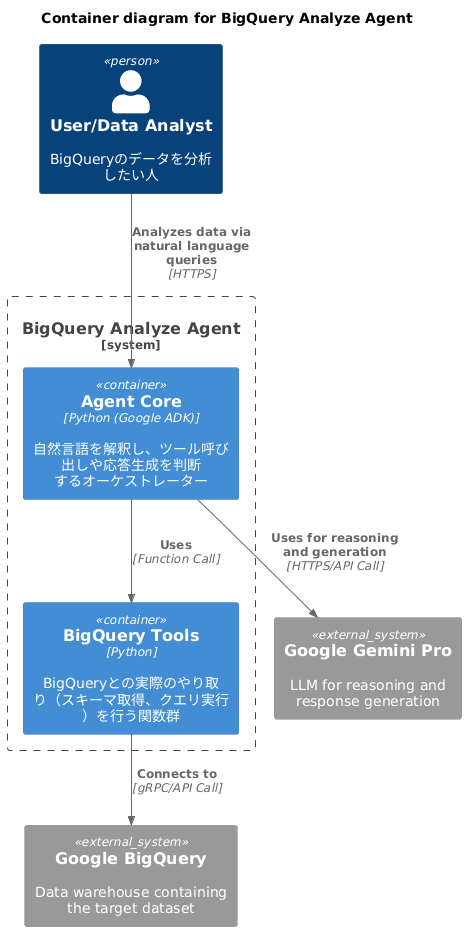

# BigQuery Analyze Agent

## 概要

このプロジェクトは、 Google ADK ( Agent Development Kit ) を利用して、 BigQuery 上のデータを分析するAIエージェントです。
自然言語による問い合わせに対して、 BigQuery のテーブルを検索・分析し、結果を返します。

## 主な機能

- **自然言語でのデータ問い合わせ**: 「昨年の売上が最も高かった商品は？」といった自然言語での質問に回答します。
- **データ分析**: 指定された条件に基づき、データの集計や分析を実行します。
- **レポート生成**: 分析結果を元に、簡単なレポートを生成します。

## アーキテクチャ

### システム構成図



<details>
<summary>PlantUML Code</summary>

```plantuml
@startuml C4_BigQuery_Agent_Architecture
!include https://raw.githubusercontent.com/plantuml-stdlib/C4-PlantUML/master/C4_Container.puml

title Container diagram for BigQuery Analyze Agent

Person(user, "User/Data Analyst", "BigQueryのデータを分析したい人")

System_Ext(gemini, "Google Gemini Pro", "LLM for reasoning and response generation")
System_Ext(bigquery, "Google BigQuery", "Data warehouse containing the target dataset")

System_Boundary(agent_system, "BigQuery Analyze Agent") {
    Container(agent_core, "Agent Core", "Python (Google ADK)", "自然言語を解釈し、ツール呼び出しや応答生成を判断するオーケストレーター")
    Container(bq_tools, "BigQuery Tools", "Python", "BigQueryとの実際のやり取り（スキーマ取得、クエリ実行）を行う関数群")
}

Rel(user, agent_core, "Analyzes data via natural language queries", "HTTPS")
Rel(agent_core, gemini, "Uses for reasoning and generation", "HTTPS/API Call")
Rel(agent_core, bq_tools, "Uses", "Function Call")
Rel(bq_tools, bigquery, "Connects to", "gRPC/API Call")

@enduml
```

</details>

### 処理の流れ

1. **User** が自然言語で **Agent Core** に質問します。
1. **Agent Core** は **Gemini Pro** の能力を使って質問を解釈し、どの **BigQuery Tool** を使うべきか判断します。
1. **Agent Core** が適切な **BigQuery Tool**（例: `get_all_table_schemas_in_dataset`）を呼び出します。
1. **BigQuery Tool** は **Google BigQuery** にスキーマ取得やクエリ実行のリクエストを送信します。
1. **BigQuery** は結果を **BigQuery Tool** に返します。
1. **Agent Core** はツールから受け取った結果を元に、再度 **Gemini Pro** を使って最終的な回答を生成します。
1. 生成された回答が **User** に返されます。

## セットアップ方法

### 前提条件

- Python 3.13 以上
- `uv` ( Python パッケージインストーラー)
- Google Cloud SDK

### 環境構築

1.  **リポジトリのクローン:**

    ```bash
    git clone <repository-url>
    cd bigquery-analyze-agent
    ```

2.  **仮想環境の作成と有効化:**

    ```bash
    uv venv
    source .venv/bin/activate
    ```

3.  **依存関係のインストール:**

    ```bash
    uv sync
    ```

4.  **Google Cloud 認証:**

    ```bash
    gcloud auth application-default login
    ```

## 使い方

エージェントを実行するには、以下のコマンドを実行します。

```bash
uv run adk web
```

## ディレクトリ構成

```txt
.
├── agents/              # エージェントのロジック
│   └── jp-analyze/
│       └── agent.py
├── main.py              # アプリケーションのエントリーポイント
├── pyproject.toml       # プロジェクト定義と依存関係
├── README.md            # プロジェクトの簡単な説明
└── resources/           # Terraform定義やサンプルデータ
    ├── infra/
    └── sample-datas/
```