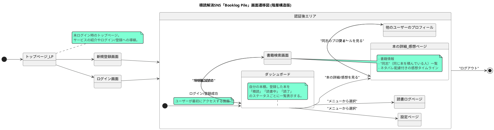

# **積読解消SNS「Booklog Pile」マスター設計書**

このドキュメントは、積読解消SNS「Booklog Pile」を開発するためのマスター設計書です。AIコーディングエージェントが開発を進める際の、唯一の信頼できる情報源（Single Source of Truth）となります。

## **1\. プロジェクト概要 (Project Overview)**

### **1.1. コンセプト**

「読もうと思って買ったのに、読まずに積んである本」…多くの人が抱えるこの「積読」を解消し、読書体験を共有するためのソーシャルネットワークサービスです。「積読」という共通の悩みを持つ人同士をつなげ、励まし合いながら読書を進めるモチベーションを育みます。

### **1.2. 主要機能リスト**

- **かんたん蔵書登録機能:** ISBNスキャンやキーワード検索で本を登録できる。
- **ステータス管理機能:** 本を「積読」「読書中」「読了」のステータスで管理できる。
- **"同志"マッチング機能:** 同じ本を「積読」している他のユーザーを探せる。
- **ネタバレなしの感想共有機能:** ネタバレの有無を選択して感想を投稿・閲覧できる。
- **読書ログの可視化:** 月間の読書数などをグラフで確認できる。

## **2\. 技術スタックと規約 (Tech Stack & Conventions)**

### **2.1. 技術スタック**

- **フロントエンド:** Next.js (App Router), React, TypeScript, Tailwind CSS
- **バックエンド:** Node.js, Express, TypeScript, Prisma (ORM)
- **データベース:** PostgreSQL
- **APIクライアント:** Axios または Fetch API
- **状態管理:** React Context API または Zustand (必要に応じて導入)

### **2.2. 命名規則**

- **ディレクトリ, ファイル名:** kebab-case (例: book-card.tsx)
- **Reactコンポーネント:** PascalCase (例: BookCard)
- **変数, 関数:** camelCase (例: fetchBooks)
- **データベーステーブル, カラム:** snake_case (例: booklog_entries)
- **APIエンドポイント:** kebab-case (例: /booklog-entries)

### **2.3. ディレクトリ構造（推奨）**

```
/
├── app/
├── components/
├── lib/
├── hooks/
└── package.json
```

## **3\. データベーススキーマ (Database Schema)**

以下に、PostgreSQL用のテーブル定義を示します。Prismaを利用する場合、これを元に schema.prisma を作成してください。

```sql
\-- ユーザーテーブル
CREATE TABLE "users" (
 "id" UUID PRIMARY KEY DEFAULT gen_random_uuid(),
 "username" VARCHAR(255) NOT NULL,
 "email" VARCHAR(255) UNIQUE NOT NULL,
 "password_hash" VARCHAR(255) NOT NULL,
 "created_at" TIMESTAMP WITH TIME ZONE DEFAULT CURRENT_TIMESTAMP NOT NULL
);

\-- 書籍テーブル (外部APIからの情報をキャッシュ)
CREATE TABLE "books" (
 "isbn" VARCHAR(13) PRIMARY KEY,
 "title" VARCHAR(255) NOT NULL,
 "author" VARCHAR(255),
 "publisher" VARCHAR(255),
 "published_date" VARCHAR(20),
 "description" TEXT,
 "page_count" INTEGER,
 "thumbnail_url" TEXT
);

\-- 蔵書エントリテーブル
\-- どのユーザーがどの本をどのステータスで持っているかを管理する
CREATE TABLE "booklog_entries" (
 "id" UUID PRIMARY KEY DEFAULT gen_random_uuid(),
 "user_id" UUID NOT NULL REFERENCES "users"("id") ON DELETE CASCADE,
 "book_isbn" VARCHAR(13) NOT NULL REFERENCES "books"("isbn"),
 "status" VARCHAR(50) NOT NULL CHECK (status IN ('積読', '読書中', '読了')),
 "added_at" TIMESTAMP WITH TIME ZONE DEFAULT CURRENT_TIMESTAMP NOT NULL,
 UNIQUE ("user_id", "book_isbn") \-- 同じユーザーが同じ本を複数登録できないようにする
);

\-- 感想テーブル
CREATE TABLE "reviews" (
 "id" UUID PRIMARY KEY DEFAULT gen_random_uuid(),
 "booklog_entry_id" UUID NOT NULL REFERENCES "booklog_entries"("id") ON DELETE CASCADE,
 "user_id" UUID NOT NULL REFERENCES "users"("id") ON DELETE CASCADE,
 "comment" TEXT NOT NULL,
 "has_spoiler" BOOLEAN NOT NULL DEFAULT false,
 "created_at" TIMESTAMP WITH TIME ZONE DEFAULT CURRENT_TIMESTAMP NOT NULL
);
```

## **4\. API仕様 (API Specification)**

以下のOpenAPI定義に従ってAPIを実装してください。

### **4.1. OpenAPI 定義**

```yaml
openapi: 3.0.3
info:
  title: Booklog Pile API
  description: |-
    積読（つんどく）解消SNS「Booklog Pile」のAPI仕様書。
    ユーザーは本を登録し、読書ステータスを管理し、他のユーザーと読書体験を共有できます。
  version: 1.0.0
servers:
  - url: https://api.booklog-pile.com/v1
    description: 本番環境サーバー
  - url: http://localhost:3000/v1
    description: 開発環境サーバー

#============================================
# Paths (APIエンドポイント)
#============================================
paths:
  # ユーザー認証
  /auth/register:
    post:
      tags:
        - Authentication
      summary: 新規ユーザー登録
      description: 新しいユーザーアカウントを作成します。
      requestBody:
        required: true
        content:
          application/json:
            schema:
              $ref: "#/components/schemas/UserRegistration"
      responses:
        "201":
          description: ユーザー登録成功
          content:
            application/json:
              schema:
                $ref: "#/components/schemas/User"
        "400":
          description: 不正なリクエスト（メールアドレスの重複など）

  /auth/login:
    post:
      tags:
        - Authentication
      summary: ログイン
      description: メールアドレスとパスワードで認証し、アクセストークンを取得します。
      requestBody:
        required: true
        content:
          application/json:
            schema:
              $ref: "#/components/schemas/UserLogin"
      responses:
        "200":
          description: ログイン成功
          content:
            application/json:
              schema:
                type: object
                properties:
                  accessToken:
                    type: string
                    description: APIアクセスのためのJWT
        "401":
          description: 認証失敗

  # ユーザー情報
  /users/me:
    get:
      tags:
        - User
      summary: 自分のユーザー情報を取得
      security:
        - bearerAuth: []
      responses:
        "200":
          description: 成功
          content:
            application/json:
              schema:
                $ref: "#/components/schemas/User"
        "401":
          description: 認証エラー

  # 書籍検索
  /books/search:
    get:
      tags:
        - Book
      summary: 書籍を検索
      description: ISBNまたはキーワードで外部データベースから書籍情報を検索します。
      parameters:
        - name: isbn
          in: query
          description: 書籍のISBNコード
          schema:
            type: string
        - name: keyword
          in: query
          description: 書籍のタイトルや著者名などのキーワード
          schema:
            type: string
      responses:
        "200":
          description: 検索結果
          content:
            application/json:
              schema:
                type: array
                items:
                  $ref: "#/components/schemas/Book"
        "404":
          description: 書籍が見つからない

  # 蔵書（積読リスト）
  /booklog:
    get:
      tags:
        - Booklog
      summary: 自分の蔵書リストを取得
      description: 自分の「積読」「読書中」「読了」の書籍リストを取得します。
      security:
        - bearerAuth: []
      parameters:
        - name: status
          in: query
          description: "ステータスで絞り込み (`積読`, `読書中`, `読了`)"
          schema:
            $ref: "#/components/schemas/BookStatus"
      responses:
        "200":
          description: 成功
          content:
            application/json:
              schema:
                type: array
                items:
                  $ref: "#/components/schemas/BooklogEntry"
    post:
      tags:
        - Booklog
      summary: 蔵書リストに本を追加
      description: ISBNを指定して、自分の蔵書リストに本を追加します。
      security:
        - bearerAuth: []
      requestBody:
        required: true
        content:
          application/json:
            schema:
              type: object
              properties:
                isbn:
                  type: string
                  description: 追加したい本のISBNコード
                  example: "9784101010015"
      responses:
        "201":
          description: 追加成功
          content:
            application/json:
              schema:
                $ref: "#/components/schemas/BooklogEntry"
        "400":
          description: 不正なISBN、または既に追加済み

  /booklog/{booklogId}:
    patch:
      tags:
        - Booklog
      summary: 蔵書のステータスを更新
      description: "蔵書リスト内の本のステータスを更新します（例：「積読」→「読書中」）。"
      security:
        - bearerAuth: []
      parameters:
        - name: booklogId
          in: path
          required: true
          schema:
            type: string
            format: uuid
      requestBody:
        required: true
        content:
          application/json:
            schema:
              type: object
              properties:
                status:
                  $ref: "#/components/schemas/BookStatus"
      responses:
        "200":
          description: 更新成功
          content:
            application/json:
              schema:
                $ref: "#/components/schemas/BooklogEntry"
        "404":
          description: 指定された蔵書が見つからない
    delete:
      tags:
        - Booklog
      summary: 蔵書を削除
      description: 蔵書リストから本を削除します。
      security:
        - bearerAuth: []
      parameters:
        - name: booklogId
          in: path
          required: true
          schema:
            type: string
            format: uuid
      responses:
        "204":
          description: 削除成功
        "404":
          description: 指定された蔵書が見つからない

  # 感想
  /booklog/{booklogId}/reviews:
    get:
      tags:
        - Review
      summary: 本の感想一覧を取得
      parameters:
        - name: booklogId
          in: path
          required: true
          schema:
            type: string
            format: uuid
      responses:
        "200":
          description: 成功
          content:
            application/json:
              schema:
                type: array
                items:
                  $ref: "#/components/schemas/Review"
    post:
      tags:
        - Review
      summary: 感想を投稿
      description: 読了した本に感想を投稿します。
      security:
        - bearerAuth: []
      parameters:
        - name: booklogId
          in: path
          required: true
          schema:
            type: string
            format: uuid
      requestBody:
        required: true
        content:
          application/json:
            schema:
              $ref: "#/components/schemas/ReviewInput"
      responses:
        "201":
          description: 投稿成功
          content:
            application/json:
              schema:
                $ref: "#/components/schemas/Review"

  # "同志" マッチング
  /comrades/search:
    get:
      tags:
        - Comrade
      summary: 同志を探す
      description: 自分と同じ本を「積読」している他のユーザーを探します。
      security:
        - bearerAuth: []
      parameters:
        - name: isbn
          in: query
          required: true
          description: 探したい本のISBNコード
          schema:
            type: string
      responses:
        "200":
          description: 成功
          content:
            application/json:
              schema:
                type: array
                items:
                  $ref: "#/components/schemas/User" # ユーザー情報の配列を返す
        "404":
          description: 対象の書籍またはユーザーが見つからない

  # 読書ログ
  /stats/me:
    get:
      tags:
        - Statistics
      summary: 自分の読書ログを取得
      description: 月間の読書数などの統計データを取得します。
      security:
        - bearerAuth: []
      responses:
        "200":
          description: 成功
          content:
            application/json:
              schema:
                $ref: "#/components/schemas/ReadingStats"

#============================================
# Components (再利用可能な定義)
#============================================
components:
  # 認証スキーマ
  securitySchemes:
    bearerAuth:
      type: http
      scheme: bearer
      bearerFormat: JWT

  # データスキーマ
  schemas:
    User:
      type: object
      properties:
        id:
          type: string
          format: uuid
        username:
          type: string
          example: "booklover"
        email:
          type: string
          format: email
        createdAt:
          type: string
          format: date-time

    UserRegistration:
      type: object
      required:
        - username
        - email
        - password
      properties:
        username:
          type: string
        email:
          type: string
          format: email
        password:
          type: string
          format: password
          minLength: 8

    UserLogin:
      type: object
      required:
        - email
        - password
      properties:
        email:
          type: string
          format: email
        password:
          type: string
          format: password

    Book:
      type: object
      properties:
        isbn:
          type: string
          description: ISBN-13
          example: "9784101010015"
        title:
          type: string
          example: "こころ"
        author:
          type: string
          example: "夏目漱石"
        publisher:
          type: string
          example: "新潮社"
        publishedDate:
          type: string
          format: date
          example: "1989-05-20"
        description:
          type: string
        pageCount:
          type: integer
          example: 280
        thumbnailUrl:
          type: string
          format: uri
          example: "https://cover.openbd.jp/9784101010015.jpg"

    BooklogEntry:
      type: object
      properties:
        id:
          type: string
          format: uuid
        user:
          $ref: "#/components/schemas/User"
        book:
          $ref: "#/components/schemas/Book"
        status:
          $ref: "#/components/schemas/BookStatus"
        addedAt:
          type: string
          format: date-time

    BookStatus:
      type: string
      enum: [積読, 読書中, 読了]
      example: "積読"

    Review:
      type: object
      properties:
        id:
          type: string
          format: uuid
        user:
          $ref: "#/components/schemas/User"
        comment:
          type: string
          example: "非常に考えさせられる作品でした。"
        hasSpoiler:
          type: boolean
          default: false
        createdAt:
          type: string
          format: date-time

    ReviewInput:
      type: object
      required:
        - comment
      properties:
        comment:
          type: string
        hasSpoiler:
          type: boolean
          description: "ネタバレを含む場合はtrue"
          default: false

    ReadingStats:
      type: object
      properties:
        monthlyReadCount:
          type: integer
          description: 今月の読了冊数
          example: 5
        monthlyPageCount:
          type: integer
          description: 今月の読了ページ数
          example: 1500
        history:
          type: array
          description: 'グラフ表示用のデータ（例: [{month: "2025-05", count: 3}, ...]）'
          items:
            type: object
            properties:
              month:
                type: string
                example: "2025-05"
              count:
                type: integer
                example: 3
```

## **5\. 画面要件 (Screen Requirements)**

### **5.1. 画面遷移図**



### **5.2. 各画面の機能要件**

#### **未認証エリア**

- **トップページ (LP) (/)**
  - **役割:** サービスの魅力や機能を伝え、新規登録やログインを促す。
  - **要件:** サービス紹介コンテンツ、新規登録ボタン、ログインボタンを配置する。
- **新規登録ページ (/register)**
  - **役割:** ユーザーが新しいアカウントを作成する。
  - **要件:** ユーザー名、メールアドレス、パスワード入力欄、登録ボタンを配置。POST /auth/register を呼び出し、成功後はダッシュボードに遷移する。
- **ログインページ (/login)**
  - **役割:** 既存ユーザーがサービスにログインする。
  - **要件:** メールアドレス、パスワード入力欄、ログインボタンを配置。POST /auth/login を呼び出し、成功後はダッシュボードに遷移する。

#### **認証後エリア**

- **ダッシュボード (/dashboard)**
  - **役割:** 自身の蔵書を管理する中心的な画面。
  - **UI/機能要件:**
    - 「積読」「読書中」「読了」のタブを配置し、表示を切り替えられる。
    - 選択中のステータスに該当する書籍をカード形式で一覧表示する。
    - 書籍カードには書影、タイトル、著者名を表示する。
    - 各書籍カードからステータスを変更できるドロップダウンメニューを提供する。
    - 書籍検索ページに遷移するための「本を追加」ボタン（フローティングアクションボタンなど）を配置する。
  - **データ連携:**
    - 画面表示時に GET /booklog を呼び出して全蔵書を取得する。
    - ステータス変更時、PATCH /booklog/{booklogId} を呼び出す。
    - 書籍カードクリックで、本の詳細・感想ページに遷移する。
- **書籍検索ページ (/search)**
  - **役割:** 外部データベースから本を探し、自分の本棚に追加する。
  - **UI/機能要件:**
    - キーワード入力用の検索バーを配置する。
    - （任意）スマートフォンのカメラを使ったISBNバーコードスキャン機能を提供する。
    - 検索結果を一覧で表示する。各結果には「本棚に追加」ボタンを設ける。
  - **データ連携:**
    - 検索実行時、GET /books/search を呼び出す。
    - 「本棚に追加」ボタンクリック時、POST /booklog を呼び出す。成功後、ユーザーにフィードバック（例: トースト通知）を表示し、ダッシュボードへ戻るか、検索を継続できる。
- **本の詳細・感想ページ (/booklog/{booklogId})**
  - **役割:** 一冊の本に関する詳細情報、他のユーザーの感想、同じ本を読む"同志"を確認する。
  - **UI/機能要件:**
    - 書籍の基本情報（書影、タイトル、著者、概要など）を表示する。
    - この本を「積読」にしている"同志"ユーザーのリストを表示する。ユーザー名クリックでそのユーザーのプロフィールページに遷移する。
    - この本の感想を投稿するフォームを配置する（ネタバレ有無のチェックボックス付き）。
    - 投稿済みの感想をタイムライン形式で表示する。「ネタバレあり」の感想は、クリックするまで内容が隠されている。
  - **データ連携:**
    - 初期表示時、GET /booklog/{booklogId} (蔵書情報)、GET /comrades/search?isbn={isbn} ("同志"情報)、GET /booklog/{booklogId}/reviews (感想リスト) を並行して呼び出す。
    - 感想投稿時、POST /booklog/{booklogId}/reviews を呼び出し、成功したらタイムラインを更新する。
- **読書ログページ (/stats)**
  - **役割:** 自身の読書活動を振り返る。
  - **UI/機能要件:**
    - 今月の読了冊数、総読了ページ数などを表示する。
    - 月ごとの読了冊数の推移を示す棒グラフなどを表示する。
  - **データ連携:**
    - GET /stats/me を呼び出し、取得した統計データを表示する。

#### **5.3.1. ログイン画面 (**/login**)**

```

+------------------------------------------------------+
| Header: Booklog Pile                                 |
+------------------------------------------------------+
|                                                      |
|                      ログイン                        |
|                                                      |
|   +----------------------------------------------+   |
|   | Email: [__________________________________]  |   |
|   +----------------------------------------------+   |
|                                                      |
|   +----------------------------------------------+   |
|   | Password: [_______________________________]  |   |
|   +----------------------------------------------+   |
|                                                      |
|   +----------------------------------------------+   |
|   |                  ログインする                |   |
|   +----------------------------------------------+   |
|                                                      |
|                 アカウントをお持ちでないですか？     |
|                       [新規登録はこちら]             |
|                                                      |
+------------------------------------------------------+

```

#### **5.3.2. ダッシュボード画面 (**/dashboard**)**

```

+------------------------------------------------------+
| Header: Booklog Pile     [読書ログ] [設定] [ログアウト]|
+------------------------------------------------------+
|                                                      |
|  +-----------------+ +-----------------+ +---------+ |
|  |      積読       | |     読書中      | |   読了  | |  <- Tabs
|  +-----------------+ +-----------------+ +---------+ |
|                                                      |
| +----------+  +----------+  +----------+  +----------+ |
| | [書影]   |  | [書影]   |  | [書影]   |  | [書影]   | |
| | タイトル |  | タイトル |  | タイトル |  | タイトル | |
| | 著者名   |  | 著者名   |  | 著者名   |  | 著者名   | |
| | [v]変更  |  | [v]変更  |  | [v]変更  |  | [v]変更  | |
| +----------+  +----------+  +----------+  +----------+ |
|                                                      |
| +----------+  +----------+                           |
| | [書影]   |  | [書影]   |                           |
| | タイトル |  | タイトル |        (+) <-- Floating   |
| | 著者名   |  | 著者名   |             Action Button  |
| | [v]変更  |  | [v]変更  |                           |
| +----------+  +----------+                           |
|                                                      |
+------------------------------------------------------+

```

#### **5.3.3. 書籍検索画面 (**/search**)**

```

+------------------------------------------------------+
| Header: Booklog Pile          [< ダッシュボードへ戻る] |
+------------------------------------------------------+
|                                                      |
|   +------------------------------------------------+ |
|   | [🔍 ____________________________] [検索]        | |
|   +------------------------------------------------+ |
|                                                      |
|  --- 検索結果 ------------------------------------  |
|                                                      |
| +------+---------------------------------+----------+ |
| |[書影] | タイトル１                      |          | |
| |      | 著者名１                        | [追加]   | |
| +------+---------------------------------+----------+ |
| |[書影] | タイトル２                      |          | |
| |      | 著者名２                        | [追加]   | |
| +------+---------------------------------+----------+ |
|                                                      |
+------------------------------------------------------+

```

#### **5.3.4. 本の詳細・感想ページ (**/booklog/{id}**)**

```

+------------------------------------------------------+
| Header: Booklog Pile          [< ダッシュボードへ戻る] |
+------------------------------------------------------+
|                                                      |
| +-----------+  タイトル                              |
| |  [書影]   |  著者: 著者名                          |
| |           |  出版社: 出版社名                      |
| +-----------+  ------------------------------------  |
|              概要文................................  |
|              ......................................  |
|                                                      |
| --- "同志"リスト -------- | --- 感想タイムライン ----- |
| +-----------------------+ | +----------------------+ |
| | @user_A               | | | @user_C              | |
| | @user_B               | | | 非常に面白い...      | |
| |                       | | +----------------------+ |
| +-----------------------+ | | @user_D (ネタバレ有) | |
|                         | | | [クリックで表示]     | |
| --- 感想を投稿する ------ | +----------------------+ |
| +-----------------------+ | |                      | |
| | [___________________] | |                        | |
| | [___________________] | |                        | |
| | [ ]ネタバレを含む     | |                        | |
| | [投稿する]            | |                        | |
| +-----------------------+ |                        | |
+------------------------------------------------------+

```

#### **5.3.5. 読書ログページ (**/stats**)**

```

+------------------------------------------------------+
| Header: Booklog Pile        [< ダッシュボードへ戻る] |
+------------------------------------------------------+
|                                                      |
|                     あなたの読書ログ                 |
|                                                      |
|  +---------------------+  +------------------------+ |
|  |  今月の読了冊数     |  |  今月の総ページ数      | |
|  |        5 冊         |  |       1,502 ページ     | |
|  +---------------------+  +------------------------+ |
|                                                      |
|                 月別読了数グラフ                     |
|                                                      |
|     ||                                               |
|   ||||                                               |
|  ||||||| | |                                         |
|  +-------------------------------------------------+ |
|    1月 2月 3月 4月 5月...                            |
|                                                      |
+------------------------------------------------------+
```
