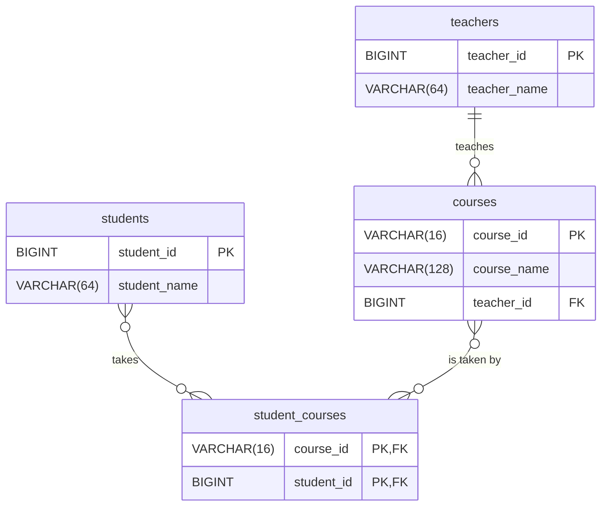

```mermaid
erDiagram
    teachers {
        BIGINT teacher_id PK
        VARCHAR(64) teacher_name
    }
    courses {
        VARCHAR(16) course_id PK
        VARCHAR(128) course_name
        BIGINT teacher_id FK
    }
    students {
        BIGINT student_id PK
        VARCHAR(64) student_name
    }
    student_courses {
        VARCHAR(16) course_id PK, FK
        BIGINT student_id PK, FK
    }

    teachers ||--o{ courses : "teaches"
    students }o--o{ student_courses : "takes"
    courses }o--o{ student_courses : "is taken by"
```
